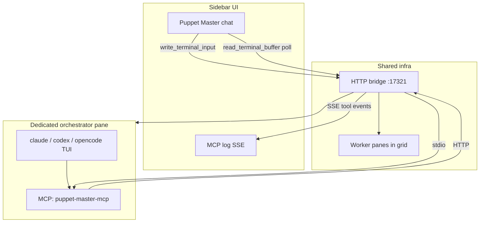

# Puppet Master — Sidebar Orchestration Routing

The Puppet Master sidebar can drive pane orchestration through two families of backends. Today only **LLM API** is implemented; **CLI + MCP** is the planned alternative that reuses your existing agent subscriptions and MCP config.

## Two backends compared

| | **LLM API** (`api`) | **CLI + MCP** (`claude_cli` / `codex_cli` / `opencode_cli`) |
|---|---|---|
| **Who thinks?** | Your API key (Anthropic / OpenAI / OpenRouter) | The CLI's own model + auth |
| **Who calls MCP tools?** | In-app loop (`puppet-master.ts` → bridge HTTP) | The CLI, via `@puppet-master/mcp` stdio |
| **Cost / auth** | Per-token API billing | Whatever the CLI already uses |
| **Visibility** | Text streams in sidebar; tools in MCP log | Full TUI in a dedicated pane + MCP log from bridge SSE |
| **Status** | **Shipped** | **Planned** (selector visible, disabled) |

Both paths hit the **same** 5 tools on the **same** HTTP bridge — no duplicate orchestration logic.

---

## Current path: LLM API (implemented)

```mermaid
sequenceDiagram
  participant User
  participant Sidebar
  participant LLM as LLM API
  participant Loop as puppet-master.ts
  participant Bridge as HTTP bridge
  participant PTY as Rust PTY

  User->>Sidebar: prompt
  Sidebar->>Loop: runPuppetMasterLoop
  loop up to 12 turns
    Loop->>LLM: messages + 5 tool defs
    LLM-->>Loop: text / tool_use
    Loop->>Bridge: spawn / read / write / kill
    Bridge->>PTY: PTY ops
    PTY-->>Bridge: scrollback / status
    Bridge-->>Loop: tool results
  end
  Loop-->>Sidebar: streamed reply + MCP log
```

**Custom models**: add any `provider` + `model_id` in Settings → Custom models. They merge with built-in presets in the sidebar picker.

---

## Planned path: CLI agent as orchestrator

Instead of calling an LLM API from the browser, the sidebar delegates to a **dedicated orchestrator pane** running Claude Code, Codex CLI, or OpenCode — with `@puppet-master/mcp` already registered so the CLI can call `list_panes`, `spawn_agent`, etc.



### Per-backend mapping

| Backend setting | Agent preset | Orchestrator pane | MCP host config |
|-----------------|--------------|-------------------|-----------------|
| `claude_cli` | `claude` | `claude.exe` in project cwd | Claude Code `mcpServers` |
| `codex_cli` | `codex` | `codex.exe` | Codex MCP config |
| `opencode_cli` | `opencode` | `opencode.cmd` | OpenCode MCP config |

Settings field `orchestrator_pane_id` (optional) pins a stable pane so restarts reuse the same session.

### Implementation phases

#### Phase 1 — MCP bootstrap helper
- `packages/app/src/lib/mcp-config.ts`
- Generate the JSON snippet users need for each CLI host pointing at `puppet-master-mcp` (or `npx @puppet-master/mcp`)
- Settings UI: "Copy MCP config for Claude / Codex / OpenCode"
- On first use of a CLI backend, verify MCP is reachable (bridge health + optional `list_panes` probe from CLI)

#### Phase 2 — Dedicated orchestrator pane lifecycle
- `runPuppetMasterCliLoop` in `puppet-master-cli.ts`:
  1. `spawn_agent` (or attach to `orchestrator_pane_id`) with `agent_type` matching backend
  2. Wait for TUI ready heuristic (prompt in scrollback)
  3. `write_terminal_input` with user message (+ optional system preamble once per session)
  4. Poll `read_terminal_buffer` until idle / completion heuristic
  5. Strip ANSI + TUI chrome; surface final text in sidebar
- Persist `orchestrator_pane_id` in settings after first spawn
- Interrupt → `write_terminal_input` with Ctrl+C or CLI-specific cancel sequence

#### Phase 3 — UX polish
- Enable CLI backends in sidebar selector (remove `disabled`)
- Optional mini-preview of orchestrator pane in sidebar
- Show CLI tool calls in MCP log (already flows via bridge SSE as `external`)
- Backend-specific ready prompts and timeout tuning

#### Phase 4 — Hybrid (optional)
- **API orchestrator** spawns worker panes; **CLI workers** do implementation
- Or: API plans in sidebar, hands off with `write_terminal_input` to a Claude pane without MCP on the orchestrator

---

## Why CLI + MCP is attractive

1. **No duplicate API keys** in Puppet Master when you already pay for Claude Code / Codex.
2. **Same tools as Cursor** — configure MCP once; Cursor and the sidebar orchestrator share the bridge.
3. **Full agent capabilities** — CLIs have file edit, search, and host-specific tools beyond our 5 pane tools.
4. **Trade-off**: harder to parse TUI output, slower round-trips, session state lives in the pane not in sidebar history.

---

## Recommended default

| User profile | Default backend |
|--------------|-----------------|
| Wants one GUI, OpenRouter / API keys | `api` |
| Already lives in Claude Code | `claude_cli` |
| Codex subscriber | `codex_cli` |
| OpenCode user | `opencode_cli` |

---

## Files touched / to touch

| File | Role |
|------|------|
| `packages/shared/src/schemas.ts` | `OrchestratorBackend`, `custom_models`, `orchestrator_pane_id` |
| `packages/app/src/lib/puppet-master.ts` | API loop (done) |
| `packages/app/src/lib/puppet-master-cli.ts` | CLI loop (stub → implement Phase 2) |
| `packages/app/src/lib/mcp-config.ts` | MCP JSON generators (Phase 1) |
| `packages/app/src/components/PuppetMasterSidebar.tsx` | Backend + model pickers |
| `packages/app/src/components/SettingsPanel.tsx` | Custom models CRUD |
| `MCP_HOSTS.md` | Link here for external + orchestrator setup |

---

## Manual workaround today

Until CLI backend ships:

1. Run `npm run tauri dev` (bridge up).
2. Spawn a Claude / Codex / OpenCode pane in the grid.
3. Configure that CLI's MCP to `@puppet-master/mcp` (see `MCP_HOSTS.md`).
4. Talk to the agent **in the pane** — it will call the same MCP tools the sidebar would.

The sidebar API backend remains best for centralized chat + log in one column.
