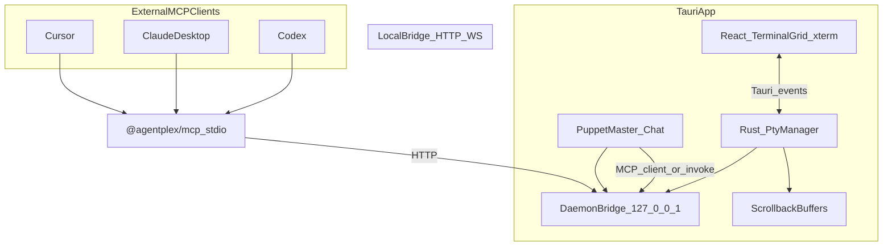

# AgentPlex (tmux-puppet-master) — Implementation Plan

## Goals

- Desktop GUI with scrollable 2-column terminal grid, each pane running a real PTY (Claude Code, Codex CLI, OpenCode CLI, PowerShell/bash).
- Fixed right sidebar: Puppet Master chat + live MCP action log.
- **Dual orchestration**: built-in LLM agent **and** external MCP clients via the same tool surface.
- Distributable as `npx agentplex` (opens GUI) plus `@agentplex/mcp` (stdio MCP for Cursor, Claude Desktop, Codex).

## Prerequisites (one-time setup on your machine)

You chose **Tauri + Rust**, but Rust is not installed yet. Before implementation:

1. Install [Rust via rustup](https://rustup.rs/) (`rustc`, `cargo`).
2. Install **Visual Studio Build Tools** with the "Desktop development with C++" workload (required for `portable-pty` / native crates on Windows).
3. Verify: `rustc --version`, `cargo --version`, `npm run tauri dev` smoke test.

Node 22 and target CLIs are already present: `claude`, `codex`, `opencode`.

**Cursor CLI limitation**: `cursor` is an IDE launcher, not an interactive agent TUI like the others. Plan includes a **"Open Cursor IDE"** preset (opens project folder) rather than pretending it is a controllable agent shell. True Cursor agent control remains via external MCP from Cursor itself.

---

## Architecture



### Three layers (from your spec)

| Layer | Tech | Responsibility |
|-------|------|----------------|
| Rendering | React + Vite + `@xterm/xterm` + FitAddon | Grid UI, focus, resize, manual keyboard input |
| PTY (OS) | Rust `portable-pty` via Tauri commands (or `tauri-plugin-pty`) | Spawn shells, read/write, resize, kill, accumulate scrollback |
| MCP orchestration | `@modelcontextprotocol/sdk` (Node) + optional built-in LLM | `list_panes`, `read_terminal_buffer`, `write_terminal_input`, `spawn_agent`, `kill_pane_process` |

### Why a local HTTP bridge?

External MCP clients (Cursor, Claude Desktop) speak **stdio JSON-RPC**. The Tauri app owns PTYs in Rust. A small Node **bridge daemon** (started with the app) exposes the MCP tool API over `127.0.0.1` so:

- The **standalone** `@agentplex/mcp` package can be registered in any MCP host config.
- The **built-in** Puppet Master uses the same tools (no duplicate logic).
- Multiple clients can connect while the GUI is running.

When the GUI is not running, `@agentplex/mcp` returns a clear error: *"Start AgentPlex first (`npx agentplex`)"*.

---

## Monorepo layout

Create at `C:\Users\Ren-pc\tmux-puppet-master` (git init via `create_project`):

```
tmux-puppet-master/
├── package.json                 # workspaces, bin: "agentplex" → packages/cli
├── packages/
│   ├── app/                     # Tauri 2 + React frontend
│   │   ├── src/                 # UI components
│   │   └── src-tauri/           # Rust PTY manager, bridge lifecycle
│   ├── mcp-server/              # @agentplex/mcp — stdio MCP for external hosts
│   ├── bridge/                  # Local HTTP/WS daemon (shared protocol)
│   ├── shared/                  # Zod schemas, agent presets, pane types
│   └── cli/                     # `agentplex` entry: spawn Tauri app / headless bridge
```

**npm packages to publish** (phase 2):

- `agentplex` — CLI + desktop app launcher
- `@agentplex/mcp` — MCP server only (for `claude_desktop_config.json`, Cursor MCP settings, `codex mcp`)

---

## Core Rust PTY manager (`src-tauri/src/pty/`)

Central `PaneRegistry` (thread-safe `HashMap<pane_id, PaneState>`):

```rust
struct PaneState {
    id: String,
    agent_type: AgentType,
    pid: u32,
    status: PaneStatus,      // Running | WaitingInput | Error | Idle
    scrollback: VecDeque<String>,  // last N lines (cap ~10_000)
    // PTY master handle for write/resize/kill
}
```

**Tauri commands** (frontend + bridge call these):

- `list_panes() -> Vec<PaneInfo>`
- `spawn_pane(agent_type, cols, rows) -> pane_id`
- `write_pane_input(pane_id, text)` — append `\r` for Enter
- `read_pane_buffer(pane_id, lines) -> string`
- `kill_pane(pane_id)`
- `set_project_path(path)` — all new panes use this `cwd`
- `resize_pane(pane_id, cols, rows)`

**Agent presets** ([`packages/shared/src/agents.ts`](packages/shared/src/agents.ts)):

| Preset | Windows command | Notes |
|--------|-----------------|-------|
| `claude` | `claude.exe` | Interactive TUI |
| `codex` | `codex.exe` | Interactive TUI |
| `opencode` | `opencode.cmd` | Interactive TUI |
| `powershell` | `powershell.exe` | Generic shell |
| `bash` | `bash` (Git Bash/WSL if found) | Fallback shell |
| `cursor` | `cursor.exe` + project path | Opens IDE, not agent TUI |

Resolve executables via `PATH` + known install locations (your `claude` at `~/.local/bin`, `codex` in AppData, etc.).

**Status heuristics** (Rust, updated on each `on_data`):

- `Error` — child process exited (non-zero or signal)
- `WaitingInput` — regex on recent lines: `(?i)(y/n|yes/no|\(Y/n\)|press enter|continue\?)`
- `Running` — process alive + output in last 30s
- `Idle` — process alive, no recent output

---

## Frontend UI (`packages/app/src/`)

### Layout (matches your spec)

```
┌──────────────────────────────────────────────────────────────┐
│ Header: [Project Path picker] [Kill All] [Restart] [Clear]  │
├────────────────────────────────────┬─────────────────────────┤
│  Scrollable 2-col terminal grid    │  Puppet Master (fixed)  │
│  ┌─────────┐ ┌─────────┐          │  - Chat input           │
│  │ Pane 1  │ │ Pane 2  │          │  - Message history      │
│  └─────────┘ └─────────┘          │  - MCP log feed         │
│  ┌─────────┐ ┌─────────┐          │                         │
│  │ Pane 3  │ │ Pane 4  │          │                         │
│  └─────────┘ └─────────┘          │                         │
│  [+ Add Pane]                      │                         │
└────────────────────────────────────┴─────────────────────────┘
```

Key components:

- [`WorkspaceHeader.tsx`](packages/app/src/components/WorkspaceHeader.tsx) — `tauri-plugin-dialog` folder picker, global actions
- [`TerminalGrid.tsx`](packages/app/src/components/TerminalGrid.tsx) — CSS grid, vertical scroll
- [`TerminalPane.tsx`](packages/app/src/components/TerminalPane.tsx) — header bar (agent dropdown, LED, PID, close) + persistent xterm instance
- [`PuppetMasterSidebar.tsx`](packages/app/src/components/PuppetMasterSidebar.tsx) — chat + MCP log
- [`usePaneRegistry.ts`](packages/app/src/hooks/usePaneRegistry.ts) — Tauri event listeners for PTY I/O

**xterm persistence rule**: one xterm instance per pane for app lifetime; re-parent DOM on scroll (per [munderdiffl.in PTY guide](http://developerlife.com)) — avoids blank screens when panes scroll off-screen.

---

## MCP tool surface (`packages/mcp-server/`)

Implements your exact toolset via bridge HTTP calls:

| Tool | Bridge endpoint | Behavior |
|------|-----------------|----------|
| `list_panes` | `GET /panes` | id, agent, pid, status |
| `spawn_agent` | `POST /panes` | `{ pane_id?, command }` or preset name |
| `read_terminal_buffer` | `GET /panes/:id/buffer?lines=N` | scrollback tail |
| `write_terminal_input` | `POST /panes/:id/input` | `{ text }` + auto `\n` |
| `kill_pane_process` | `DELETE /panes/:id` | SIGTERM → SIGKILL fallback |

**stdio safety**: all logging to `stderr` only (never `stdout`).

**External host config example** (Cursor / Claude Desktop):

```json
{
  "mcpServers": {
    "agentplex": {
      "command": "npx",
      "args": ["-y", "@agentplex/mcp"]
    }
  }
}
```

Codex: `codex mcp add agentplex -- npx -y @agentplex/mcp`

---

## Built-in Puppet Master (`packages/app/src/puppet-master/`)

LLM loop using user-provided API key (Anthropic and/or OpenAI, stored in OS keychain via `tauri-plugin-store` or `keyring` crate):

1. User sends high-level instruction in sidebar chat.
2. Orchestrator LLM receives system prompt: *"You control coding agents via MCP tools. Prefer reading buffers before writing. Confirm destructive actions."*
3. MCP client connects to `http://127.0.0.1:<bridge_port>` (same tools as external package).
4. Each tool call appended to **MCP Log Viewer** (`[MCP READ]`, `[MCP WRITE]`, etc.).
5. Loop until task complete or user interrupts.

Default model: configurable in Settings (e.g. `claude-sonnet-4-6`, `gpt-4.1`).

---

## CLI entry points (`packages/cli/`)

```bash
npx agentplex                    # Launch GUI (default)
npx agentplex --project ./foo    # Open with cwd preset
npx agentplex mcp                # Run stdio MCP only (expects GUI running)
```

Root `package.json` `"bin": { "agentplex": "./packages/cli/dist/index.js" }`.

---

## Implementation phases

### Phase 1 — Scaffold + single terminal (MVP)

- `create_project` at `C:\Users\Ren-pc\tmux-puppet-master`, `move_agent_to_root`
- Tauri 2 + React + TypeScript + Tailwind
- Rust PTY: spawn PowerShell, one xterm pane, bidirectional I/O
- Project path picker sets `cwd`

### Phase 2 — Multi-pane grid

- Pane registry, add/remove panes, 2-column scrollable grid
- Agent preset dropdown, PID display, status LED
- Global Kill All / Restart / Clear
- Scrollback buffer in Rust

### Phase 3 — Bridge + MCP server

- Local HTTP bridge in Rust (or Node sidecar spawned by Tauri)
- `@agentplex/mcp` stdio package with all 5 tools
- MCP log viewer in sidebar (bridge emits events via Tauri events → React)

### Phase 4 — Built-in Puppet Master

- Settings: API keys, model selection
- Chat UI + LLM tool-calling loop
- Same MCP tools as external clients

### Phase 5 — Polish + distribution

- `electron-builder` equivalent: Tauri bundler for `.msi` / `.exe`
- npm publish (`agentplex`, `@agentplex/mcp`)
- README with setup for Cursor, Claude Desktop, Codex MCP
- Windows ConPTY edge cases (resize on pane focus, UTF-8)

---

## Key technical risks and mitigations

| Risk | Mitigation |
|------|------------|
| Rust not installed | Document rustup + VS Build Tools as step 0 |
| `portable-pty` Windows ConPTY quirks | Test resize/focus per pane; use `tauri-plugin-pty` if it reduces boilerplate |
| Agent CLIs need real TTY | Always spawn via PTY, never `Command::output` |
| MCP stdio corruption | Strict stderr-only logging in mcp-server |
| Scrollback loss | Accumulate in Rust `on_data`; never rely on xterm buffer alone |
| Cursor not a TUI agent | Document clearly; use external MCP from Cursor to control other panes |

---

## Testing strategy

- **Rust unit tests**: scrollback truncation, status regex, pane lifecycle
- **Integration**: spawn `echo hello` in pane, read buffer via MCP tool
- **Manual E2E**: 4 panes (claude + codex + opencode + powershell), Puppet Master sends coordinated commands
- **External MCP**: register in Cursor, call `list_panes` + `write_terminal_input` while GUI runs

---

## Deliverables

1. Working Tauri desktop app with terminal grid + Puppet Master sidebar
2. `@agentplex/mcp` npm package for external orchestration
3. `agentplex` CLI via npx
4. Documentation for MCP host configuration on Windows
